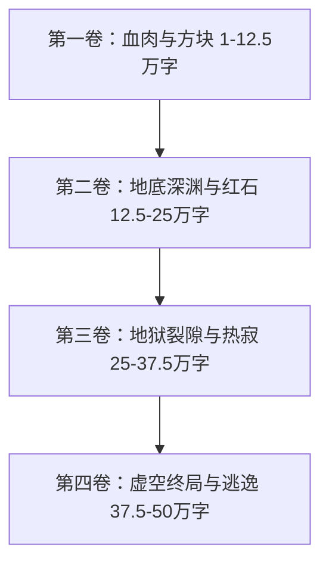

# 《方块法则：硬核生存》世界观构建与50万字全书大纲

## 一、 提示词核心提炼与世界观解析

本设定基于经典游戏《我的世界》（Minecraft）的底层机制，进行去游戏化、高沉浸感、硬核写实的现实物理化重构。

### 1. 物理法则割裂（Physical Dislocation）
* **方块切割与悬浮**：世界的基本构成单位为绝对规则的立方体（1m×1m×1m）。树木被伐断后，上层树冠不会倾倒崩塌，而是绝对静止地悬浮于半空中，断口呈现锋利的90度完美直角。
* **坍缩与收纳触感**：方块受到持续外力破坏至临界点时，不会碎裂成无序碎屑，而是瞬间坍缩成边长约15厘米的悬浮缩微实体。
* **流体与重力失真**：水与熔岩不遵循连通器原理，仅以源头方块为中心呈阶梯状扩散；沙石受重力影响坠落，泥土与岩石则永久抗拒重力。

### 2. 生理化游戏机制（Somatic Game Mechanics）
* **空手破坏的代价**：没有系统弹窗与血条显示。破坏原木需要皮肤、肌肉与硬质木质纹理进行高强度碰撞，木刺嵌入掌肉、骨节充血肿胀是获取资源必须承受的生理剧痛。
* **物品栏空间实体化**：缩微方块靠近身体时，会被强制吸入肌肉与脊椎两侧的异构造空间。主角能清楚感知到体内沉甸甸的异物积压感与异物充盈感。
* **合成台强制榫合**：将四块原木放置在特制平面上，物质分子在无钉子、无胶水、无榫卯的情况下，自动发生剧烈重组与无缝融凝，过程伴随着令人牙酸的摩擦沉响。
* **饥饿与精力消耗**：高强度的体力劳动会导致胃部产生剧烈的痉挛与撕裂感，必须通过摄入高热量食物缓解。

### 3. 感官压迫与生态恐怖（Sensory Tension & Anomaly Ecology）
* **光照与暗影化生**：太阳一旦沉落地平线，光照强度骤降。无光阴影中不会凭空出现“刷新特效”，而是空气湿度剧增，恶臭的腐肉在阴暗处快速凝结化生为僵尸；咔哒作响的干燥骨架在暗处拼合；高压真菌体在静默中靠近。
* **孤独与生存惊悚**：寂静的森林、规则的几何地形、没有任何文明痕迹的旷野，带来无处不在的情感剥离感与生存恐惧。

---

## 二、 50万字全书大纲规划

全书共计四大卷，每卷约12.5万字，总计50万字。

### 第一卷：血肉与方块（1 - 12.5万字）
* **核心主题**：现实认知崩溃、生理痛苦适应、第一夜生存保卫战、石器与铁器时代开拓。
* **主要情节**：
  * **第1-3章（黄金三章）**：在无尽方块荒野苏醒。肉体打树的剧痛与异物吸入体验。极短的日照周期。掘土潜伏的第一夜，外侧僵尸嘶吼与骨架游走。
  * **第4-15章**：打造第一把粗糙木镐与石镐。发现天然溶洞。肉类猎取（面对规则化动物的屠宰心理障碍）。建造第一座石质避难所与简易农场。
  * **第16-35章**：遭遇苦力怕（高压膨胀真菌体）轰炸避难所。重伤下逼迫自己理解红土与火把的光照抑制机制。首次冶炼铁矿，穿戴重型铁甲带来的安全感与行动受限。
  * **卷末高潮**：面对血月级别的夜间怪物狂潮，依靠地形与庇护所防御体系顽强死守，获得第一块红石矿与金矿。

### 第二卷：地底深渊与红石（12.5 - 25万字）
* **核心主题**：地下探索、矿井废墟、机械物理原理、黑曜石铸造。
* **主要情节**：
  * **第36-50章**：深入地下Y=11层。遭遇极其复杂的废弃矿井，发现前人（或异维度探索者）留下的枯骨与锈蚀铁轨。
  * **第51-75章**：红石脉冲的物理实验。将红石能量转化为机械推力、陷阱与自动门。发现地底巨大熔岩湖与水流相交产生的黑曜石。
  * **第76-90章**：黑曜石的极致硬度与破坏难题。利用钻石镐历经数日艰苦凿击获取黑曜石。地底洞穴蜘蛛毒素感染与艰难求生。
  * **卷末高潮**：搭建黑曜石传送门框架。使用打火石点燃框架，空间结构发生剧烈坍塌与紫黑色漩涡撕裂。

### 第三卷：地狱裂隙与热寂（25 - 37.5万字）
* **核心主题**：下界维度生存、环境极端化、药水炼制、堡垒攻坚。
* **主要情节**：
  * **第91-110章**：跨越门户进入下界。地狱岩的灼烧感、没有水流的干燥环境、悬浮在空中的恶魂咆哮（巨型白色漂浮构体）。
  * **第111-130章**：寻找下界堡垒。遭遇烈焰人与烈焰棒收集。获得地狱疣，回主世界建立药水炼制台，通过化学与规则反应合成抗火、迅捷药水。
  * **第131-150章**：猎杀末影人（三米高跨维度观察者），获取末影珍珠。末影人视线锁定机制的恐怖描写与近身死斗。
  * **卷末高潮**：下界堡垒核心战，合成本成末影之眼，回主世界进行定位寻踪。

### 第四卷：虚空终局与逃逸（37.5 - 50万字）
* **核心主题**：要塞掘进、末地传送门、终极巨龙、世界的真相与自我救赎。
* **主要情节**：
  * **第151-170章**：末影之眼引导下的数千公里长途跋涉。发现深埋地下的要塞图书馆与传送门房间。
  * **第171-185章**：激活末地传送门。进入星空虚空维度。黑曜石柱与末影水晶的能量束传输机制。
  * **第186-198章**：与末影龙的硬核惨烈厮杀。利用水流防飞天落伤、箭矢精准射爆水晶、床的规则爆炸物理机制。
  * **第199-200章**：击杀末影龙。终末之诗的文字在识海中流转。主角面对离开与留下的选择，理解世界本质后走向新的旅程。
